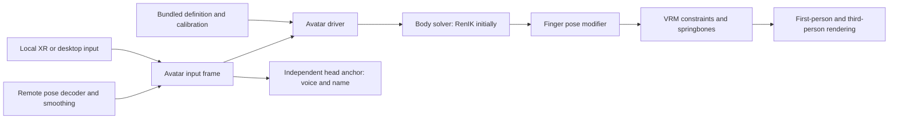

# VRM avatars: implementation plan

Status: core first pass implemented on 2026-09-12. See [current avatar behavior](AVATARS.md)
for implementation details and validation. The design below records the agreed
sequence; future solver, animation and tracking work remains deferred.

The accepted quality gate is Alicia in Mainspring, including approximate wrist
and viewpoint offsets. Robust fitting across arbitrary proportions is future
work for the humanoid-pose/Basis evaluation.

## Agreed first release

Start with Mainspring's Alicia Solid VRM, standing use, RenIK, local and remote
full bodies, articulated fingers, VRM first-person visibility, and springbones.
Add a small bundled avatar catalog; add FPSloppa's sample models after Alicia
passes the complete path. Import assets during development/build and instantiate
packaged scenes at runtime. No file picker, avatar transfer, or runtime VRM import.

Calibration should be a small VRChat-like flow. Expressions and menu/gesture
emotes follow the core avatar release. Evaluate the Basis-inspired solver after
RenIK works. Seated use may be rough initially; visemes, FBT, eye/face tracking,
OSC input, and transmitting solved body poses are later work.

Every first-release feature and validation session must work with the headset
and hands alone. The user's preference is three-point tracking even though extra
trackers are available; no FBT calibration, tracker capture, or six-point research
milestone is a prerequisite for this work.

Linux and Windows desktop/PCVR remain targets. The existing six-person theater,
video playback, and spatial voice remain the performance and integration context.

## Source inspection before implementation

| Source | Useful starting point | Integration caveat |
| --- | --- | --- |
| Prim `project/net/pose.gd` and `main.gd` | 96-byte v1 record, three world transforms, tracking bits, 20 Hz transmission | No finger state, avatar identity, height, head-valid flag, or discontinuity epoch. Controller pose semantics need to become explicit. |
| Prim `project/net/avatar.gd` | Remote lifetime, target smoothing, head voice anchor, name and speaking indication | Rendering and peer/audio state are coupled; there is no local avatar body. |
| Mainspring `Scenes/big_alicia.tscn`, `Scripts/body_base.gd`, `addons/renik/` | Alicia configuration, spine/limb modifiers, foot placement, grip/palm offsets | Extract the avatar-related setup; game-body switching and XR Tools physics hands are outside this slice. Derive scaled dimensions rather than copying scene constants. |
| Mainspring `Scripts/vrm_hand_tracker.gd` | Handles Alicia's shared finger-base hierarchy | Currently reads local XR trackers directly. Split sampling from application and verify rest-axis/thumb mapping; it is a reference, not a general retargeter. |
| FPSloppa `deathmatch/avatars/` and `deathmatch/vr/hand_input.gd` | Per-instance presentation, tracking fallbacks, wrist/rest-axis examples | Shooter locomotion, runtime asset sharing, and five-curl reduction do not match this pass. Its VRM fork explicitly disables local-body spring simulation. |
| `godot-vr-humanoid-pose` | Basis-inspired procedural estimator and replay/validation infrastructure | The estimator is Python (`basis_estimator.py`, 2,042 lines); the Godot `VRHumanoidPoseModifier` is a stub. Production use requires a runtime port and skeleton binding. Superior quality in Prim is unverified. |
| Basis `/mnt/s/code/Basis` | Separate player/avatar eye-height measurements and calibration scale | Local reference checkout is `9b05c4500` from March 2026; use the concepts, not its entire Unity calibration stack. |

Mainspring's VRM addon identifies itself as 2.0.1, with subrepo reference
`651205484c35f5cd7ba56475ff636e10db8ad674`. FPSloppa carries modifications despite
the same version string. Pin the importer and MToon source deliberately and
record any compatibility patches separately.

The upstream [Godot VRM importer](https://github.com/V-Sekai/godot-vrm) supplies
VRM 0.x/1.0 import, humanoid normalization, MToon, springbones, and head-hiding
import options. It documents retargeting problems with node constraints. First
qualify Alicia's required features; broader VRM compatibility needs additional
fixtures. VRM springbones are the initial secondary-motion feature. Interactive
PhysBone-style grabbing/stretching is a separate future feature.

## Runtime boundaries

Keep the implementation small: resource definitions, a shared avatar driver,
an input frame, and a replaceable solver adapter.

- **AvatarDefinition resource:** stable ID, content/rig revision, preimported
  PackedScene, display name/thumbnail/credits, bone bindings, neutral viewpoint,
  floor/sole offset, and bounded per-avatar fit overrides. Later it can reference
  animation libraries and an expression/menu definition. A catalog resolves
  known IDs; network data never becomes an arbitrary resource path.
- **AvatarInputFrame:** world-space view and canonical wrist transforms,
  validity, finger rotations and validity masks, timestamp/sequence, and a reset
  epoch. Desktop produces a view pose with untracked wrists. Sampling contains
  device-specific logic; the avatar and IK do not query XRServer themselves.
- **AvatarDriver:** owns one visual instance and its solver state. Use the same
  path for local, remote, and recorded input. Bind bones/rest transforms once.
  Share immutable assets; isolate mutable expression/material and simulation
  state between instances.
- **Solver adapter:** configuration from the avatar rig and calibration,
  application of input/ground context, and reset on discontinuities. It owns the
  body modifiers. Keep RenIK behind this boundary; do not invent a generalized
  plugin framework or publish an addon as part of this release.
- **Peer presentation:** keep Prim's head anchor, name, speaking indication, and
  Steam Audio player outside the replaceable model. Switching models must not
  restart voice or discard the receive stream. The tracked view anchors voice;
  inferred neck/spine motion must not move the listener or add audio jitter.

Create the local body in singleplayer as well as connected play. It consumes the
current render-frame input directly. Remote bodies consume smoothed received
targets before IK. Avoid applying the remote smoothing delay to the local body,
or smoothing the same head/wrist motion again after IK. The HMD owns the camera;
the avatar follows it.

## Calibration and coordinate rules

Use **eye-height fitting** first. VRChat exposes height-based avatar measurement
and a headset-to-floor measurement action; its avatar scaling uses the neutral
viewpoint height rather than the top of the mesh. See
[IK options](https://docs.vrchat.com/docs/ik-20-features-and-options),
[Measure Height](https://docs.vrchat.com/docs/vrchat-202231), and
[avatar scale definitions](https://creators.vrchat.com/avatars/avatar-scaling/).
This is a simplified design inspired by those behaviors, not an exact copy.

1. Avatar menu offers **Measure standing height**, a saved numerical adjustment,
   and **Recalibrate**. Give a short countdown and ask the player to stand upright
   and look forward. Sample several valid headset poses relative to the tracking
   floor and use a stable estimate. A T-pose is unnecessary for height-only fit.
2. Internally store the measured **standing eye height** in meters, and label the
   manual field accordingly. Do not mix it with anatomical top-of-head height.
   If floor tracking is unavailable, preserve a valid prior value or use a manual
   value; do not treat a seated/current arbitrary pose as a fresh measurement.
3. Measure the imported avatar's neutral viewpoint above its sole/floor plane.
   Use the VRM viewpoint metadata, checked against Alicia in preview, with a
   definition override if needed. Do not use mesh bounds, hair, or accessories.
4. Apply uniform model scale:
   `scale = calibrated_standing_eye_height / authored_neutral_eye_height`.
   Refresh derived IK lengths/offsets and spring state. Keep world meters and
   XROrigin/XRServer world scale unchanged for this initial fit mode.
5. Convert view pose to head-bone target using the scaled head-to-view offset.
   Convert controller grip or tracked wrist into the same canonical wrist
   convention before solving. Keep UI **aim** poses separate from **grip/wrist**
   poses; changing the avatar hand target must not rotate the menu ray.
6. Save the body measurement independently of avatar selection. Switching
   avatars recomputes their fit without another user calibration. Recenter
   updates the reference-space alignment and resets gait/springs; it does not
   silently remeasure a crouching player's height.

Start with fixed authored proportions at a uniform scale. Limb reach should be
bounded and favor a stable head/view attachment. Measure wrist reach error with
Alicia; if proportions make it unacceptable, add one explicit arm-fit adjustment
after the baseline. Arms-span fitting, arbitrary tiny/giant avatar scaling,
seated standing-height compensation, and multi-tracker calibration can follow.
Desktop uses the existing 1.6 m view height as its initial fit target.

## Rendering, foot placement, and springbones

Import both first- and third-person mesh variants using VRM annotations. Remap
their layers per instance: local first-person geometry, local third-person
geometry, and remote third-person geometry must be independently selectable.
The normal view sees the local body without its obstructing head and sees remote
avatars completely. A preview camera sees the local complete avatar. Do not
globally disable head mesh visibility or render both overlapping variants.

Use one skeleton/solver per avatar; multiple cameras observe the same result.
A small preview/debug viewport is enough for initial calibration and inspection.
A production planar mirror system is optional later. Verify shadows separately
so hidden heads cast the intended shadow without double-casting shared meshes.

Prim's floor is currently a visual mesh without collision. RenIK's placement
uses physics raycasts. Add a simple static floor collision matching the theater
floor on a dedicated ground layer, or feed equivalent plane intersections
through its existing raycast-result entry point. Prefer the static floor for
the first implementation. This does not require replacing Prim's locomotion.
Keep foot-ground queries on physics ticks and tracked upper-body targets current
at render time; reset placement after snap turns, recenter, and large jumps.

Make modifier order explicit: base/rest or locomotion pose → body IK → finger
pose → VRM constraints → springbones. When expressions arrive, integrate their
gaze/expression writes before constraints/springs according to the
[VRM ordering](https://github.com/vrm-c/vrm-specification/blob/master/specification/VRMC_vrm-1.0/README.md).
Godot's [SkeletonModifier3D](https://docs.godotengine.org/en/stable/classes/class_skeletonmodifier3d.html)
runs after animation playback; check the VRM addon's internal modifier ordering
on Prim's patched Godot build, rather than relying on ordinary `_process` order.

Springbones run locally on every visible avatar, including one's own body.
Initialize with the correct rest pose and final scale. Reinitialize/reset their
simulation after avatar switches, calibration, discontinuities, or long stalls;
bound simulation delta and avoid an unbounded catch-up loop. Audit imported
spring chains so they do not compete with the solver over humanoid body bones.
Treat the FPSloppa local-spring disable as a known workaround to investigate,
not a behavior to inherit. VRM colliders provide the initial collision scope;
inter-avatar/world contact and grabbing are deferred.

## Articulated hands

The user chose joint articulation, including thumb movement and finger splay,
over a five-curl network representation.

Use XRHandTracker when available, with rotation-only application to preserve
the avatar's finger lengths. Godot provides a
[humanoid hand-tracking path](https://docs.godotengine.org/en/latest/tutorials/xr/openxr_hand_tracking.html),
but runtime/controller support varies. The adapter must handle optical tracking,
controller-inferred joints, and unavailable joints. Trigger/grip/touch inputs
generate fallback finger poses only where genuine joint data is unavailable.

Represent the 15 humanoid finger joints per hand in a fixed canonical order and
rest convention. The implementation uses **wrist-relative orientations**, then
converts them through the actual avatar parent hierarchy. This collapses extra
tracking metacarpals/helpers without losing spreading and avoids assuming
Alicia's hierarchy matches OpenXR. VRM 0.x thumb names map through the importer's
normalized humanoid profile. Missing optional bones are skipped.
Do not directly copy global OpenXR joint transforms into avatar local bones.

Use one finger applicator for local and networked hands; Mainspring's direct XR
reads become an input adapter. Body IK owns wrists, fingers own finger joints.
Per-joint validity and finite/norm checks support partial tracking loss. Blend
brief loss to a relaxed/fallback pose and blend reacquisition; do not freeze a
stale hand indefinitely. Hide normal controller renders while valid avatar hands
are shown, retaining the existing model/cube display as a debug/failure fallback.
Optical hand posing does not by itself implement gesture-only menu navigation.

## Networking: small extension now, solved-body mode later

Continue solving body IK independently on each receiving client. Peers can infer
slightly different hips/feet because of history and packet loss; that is an
accepted first-release tradeoff. Share identity, scale, pose conventions, and
discontinuity state so differences do not come from missing configuration.

**Reliable avatar state:** version, stable avatar ID and rig/content revision,
calibrated target eye height, input mode (desktop/VR), and a configuration epoch.
Send current state to each newly connected peer, on changes, and after reconnect.
Resolve it against the bundled catalog. Unknown/mismatched IDs use the existing
cube representation and an appropriate status rather than attempting a load.
Network and avatar state are accepted only from that connected peer's identity.

**Pose v2:** one bounded, self-contained snapshot containing sequence/sample time,
configuration/reset epochs, view and two wrist transforms, head/wrist validity,
finger-validity masks, and up to 30 normalized finger quaternions. Keep body and
fingers together: native `Shared.poses` currently retains only the newest pose
blob per peer, so separate body/finger records under the same datagram kind would
overwrite one another before Godot reads them.

Start with float32 quaternions. Thirty rotations cost 480 bytes; the complete
record should be about 600–650 bytes, below the current 1,100-byte application
payload ceiling. At 20 Hz to five peers, 650-byte snapshots are approximately
65 kB/s outgoing per client, excluding transport and voice. These are design
estimates; specify the final layout and assert its size in implementation.
Compression can wait. Joint articulation is preserved at the stream's sampling
rate; higher temporal fidelity requires measuring whether 20 Hz is sufficient.

Keep full snapshots independent of earlier datagrams so loss recovers with the
next packet. Validate exact layout/version, ranges, finite values, quaternion
norms, and known flags. Use wrap-safe sequence comparison and restart state per
connection. Buffer only the newest snapshot awaiting its reliable configuration
epoch; bound its lifetime. Apply explicit resets for discontinuities rather than
interpolating feet across the room. Stale body tracking gets a short hold/fade
and relaxed arms; long absence falls back/hides while peer/audio lifetime remains
separate. Do not integrate ancient spring/gait state when tracking returns.

Coordinate the application compatibility version/handshake when introducing v2:
old builds must receive an understandable incompatibility result, not silently
join with invisible avatars. A legacy decoder test can remain, but mixed-version
compatibility is not an extra first-release requirement. Native transport should
continue treating the accepted pose payload as opaque bounded data.

For future sender-solved IK, preserve a driver input boundary with two modes:

- `tracked_targets`: current view/wrists plus later optional tracker roles and
  confidence; the receiving client solves.
- `solved_humanoid`: root transform/scale, canonical skeleton/profile revision,
  a bone presence/ownership mask, and local-space rotations, with optional
  translations where required. The owner can solve FBT or consume external
  animation/OSC and send the result; receivers bypass IK for those owned bones.

Use explicit authority per bone and blend mode changes without running two body
solvers over the same bones. Apply springbones once after the chosen body pose;
if final secondary bones are ever streamed, their ownership must disable the
corresponding receiver simulation. A future full-body stream needs its own
bounded codec/channel or compressed combined layout: it cannot simply append
arbitrary bone arrays to today's payload or reuse the single native pose slot
as multiple independent streams. Do not implement this second codec now.

## Delivery sequence and completion gates

| Stage | Work | Completion evidence |
| --- | --- | --- |
| 1. Alicia import and inspection | Pin VRM/MToon, add Alicia definition/catalog and a preview scene; verify neutral bones, viewpoint, materials, first-person variants, springs and credits | Clean import and exported Linux/Windows resource loading; rendered first/third-person comparison; two instances do not share mutable pose state |
| 2. One local standing body | Extract RenIK adapter, add ground collision, canonical grip/wrist targets, eye-height calibration and explicit modifier order | Head/wrist alignment in headset; standing, walking, turning, crouching, hands overhead/crossed; stable local springbones and recenter/reset |
| 3. Local articulated fingers | Separate XR sampling and canonical finger application; per-joint fallback | Both hands: open, fist, point, thumb opposition and spread; rotated wrists and partial loss; no finger bone translation/length corruption |
| 4. Networked body and fingers | Decouple peer/audio presentation; add reliable avatar state and combined pose v2; remote smoothing and reset handling | Two clients agree on avatar/height and visible articulation; late join, switch, reconnect, loss/reordering/stall and unknown-ID fallback; voice anchor/wrapper retained |
| 5. Small catalog and release qualification | Add at least one FPSloppa sample after provenance review, menu selection/persistence, desktop relaxed-arm locomotion, package assets | Second rig exercises general mapping; six avatars with active video/voice meet the measured frame budget; Linux and native Windows PCVR checks recorded |
| 6. Expressions and emotes | Add declarative gesture/menu actions and animation/expression mixing | Repeatable action ownership, blending/cancel, remote sync and late-join state |
| 7. Basis evaluation and seated improvements | Port the bounded procedural runtime behind the adapter and compare against recorded RenIK input | Wrist/head error, foot sliding, elbow/torso plausibility, transitions and CPU cost are compared on the same rigs/clips; adopt only on demonstrated improvement |

Stages 1–5 form the first release. A useful first implementation change is stage
1 plus the input/driver boundary; the first headset milestone is stage 2 with
Alicia. Stages 6 and 7 may be reprioritized independently once the core release
is stable. FBT/face/eye/viseme work follows through the established input/mixing
boundaries rather than broadening the initial delivery.

For expressions/emotes, the avatar definition should bind gesture IDs or menu
items to VRM expression weights and imported animation clips. VRM does not supply
a VRChat Animator/controller/menu package. Keep animation base layers, IK bone
ownership, and expression blending explicit. Menu-driven body emotes need masks,
tracking override rules, and cancellation; never move the HMD with an animation.
Send discrete selections/start times reliably and replaceable continuous weights
through a bounded state stream. Later viseme/eye/face sources join the same mixer
with priorities and the VRM mouth/blink/look override rules.

## Verification and scope limits

Automate codec rejection/recovery, catalog/configuration epochs, canonical finger
round trips including helpers/thumbs, and replay-based solver invariants. Cover
avatar switching without audio teardown and per-instance spring state. Extend
Prim's existing process integration tests instead of building another network
harness. Document automated results separately from visual headset observations.

Use a repeatable replay covering neutral stance, look-down/up, torso turn, snap
turn, forward/back/side movement, crouch, reach/crossed arms, one/both hands lost,
reacquisition, recenter, and a long frame stall. Render first-person and external
views. Standing is the quality gate; sitting must remain stable even if its pose
is imperfect. Profile CPU IK/springs and GPU skinning/MToon/shadows separately
with six avatars and the movie/voice running. Optimize measured bottlenecks;
keep the local avatar responsive before reducing remote update rates.

Asset notes: Alicia is the 7.9 MB VRM 0.x file with 55 humanoid entries and three
spring groups. Its sample license is DWANGO's special terms, not CC0; preserve
`LICENSE_SAMPLES.txt` and model metadata and confirm distribution terms during
asset packaging. The linked original terms page was unavailable in this review.
FPSloppa labels D/F/G as CC0, while their embedded metadata links VRoid terms
with redistribution allowed; retain source/provenance when selecting a sample.
This plan has not copied or distributed any avatar assets.

No runtime compatibility, IK quality, headset alignment, or six-avatar performance
has been demonstrated by this planning pass. Those are the explicit delivery
gates above.

## Local source references

- Prim: `project/main.gd`, `project/main.tscn`, `project/net/avatar.gd`,
  `project/net/pose.gd`, `project/xr/controller_visual.gd`, `native/src/network.rs`,
  `project/tests/integration.gd`, `docs/PROTOCOL.md`.
- Mainspring: `/mnt/s/code/mainspring/Scenes/big_alicia.tscn`,
  `/mnt/s/code/mainspring/Scripts/body_base.gd`,
  `/mnt/s/code/mainspring/Scripts/vrm_hand_tracker.gd`,
  `/mnt/s/code/mainspring/addons/renik/`,
  `/mnt/s/code/mainspring/vrm_samples/`.
- FPSloppa: `/home/s/code/FPSloppa/deathmatch/avatars/rig.gd`,
  `/home/s/code/FPSloppa/deathmatch/avatars/pose.gd`,
  `/home/s/code/FPSloppa/deathmatch/vr/hand_input.gd`,
  `/home/s/code/FPSloppa/addons/vrm/vrm_secondary.gd`.
- Pose research: `/mnt/s/code/godot-vr-humanoid-pose/README.md`,
  `validation/vr_pose_validation/basis_estimator.py`,
  `godot/addons/godot_vr_humanoid_pose/scripts/vr_humanoid_pose_modifier.gd`.
- Basis: `/mnt/s/code/Basis/Basis/Packages/com.basis.framework/IK/BasisLocalHeightCalculator.cs`,
  `IK/BasisAvatarScaleModifier.cs`, `Drivers/Common/BasisHeightDriver.cs`.
- Project context: `/home/s/org/projects/godot-vrchat-clone.md`,
  `/home/s/org/projects/vr-humanoid-pose.md` (source checkouts take precedence
  over older status notes).
