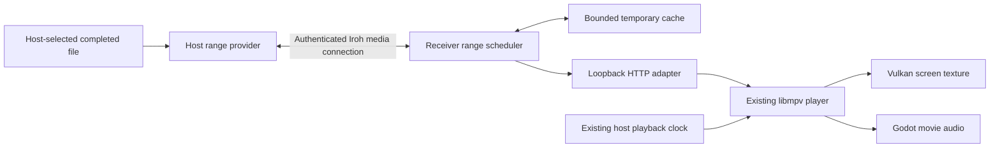

# Direct media sharing

Research and implementation plan, 2026-09-13. **Initial host-file range streaming
is implemented in this worktree.** See [protocol](PROTOCOL.md) for the concrete
wire format and [testing](TESTING.md#direct-file-sharing-worktree) for evidence
and outstanding qualification. Livestreaming and overlays remain planned.

The manifest permits Iroh 1.1; the existing lockfile actually resolves Iroh 1.2.0.
Implementation uses that locked version without a transport upgrade.

## Decision and agreed scope

Build **host-to-friends file streaming first**, using authenticated Iroh range
requests behind a receiver-local HTTP adapter for the existing libmpv player.
Keep a bounded temporary cache. Then qualify an **OBS → local RTMP ingest →
MoQ over Iroh → local mpv-compatible stream** path for livestreaming.

User decisions made while planning:

- Only the room host supplies files initially. Existing host-ordered playback
  controls remain in place.
- Received bytes use a bounded temporary cache; persistent downloads come later.
- Configuring OBS with a local ingest address is acceptable for the first live
  version. Integrated screen/window capture comes later.
- Warn before sending file/video data through a relay; permit it after explicit
  confirmation. Apply the decision per viewer and share, including fallback
  after streaming has begun. Keep voice and room presence connected.
- Overlay mode, the virtual-room peek toggle, and remote game input are later
  features. They are not dependencies or acceptance criteria for initial media
  sharing.

Use `iroh-blobs` when verified reusable storage and redistribution become useful.
It is a credible backend, but its extra indexing/storage work does not earn its
cost in the agreed first version. Do not make a swarm a prerequisite for live
streaming. Keep URL playback, yt-dlp, subtitles, Vulkan video textures,
Godot-routed movie audio, spatial voice, and Linux/Windows PCVR.

## Evidence from Prim

Inspected main checkout `/home/s/code/prim` at
`0f6345c038efe44af94cdc606ea717072394bde3`, including the current dirty workspace
for integration boundaries. GNA was at `5ba002f9ebbe4baf8e513a31ab33d403492442fa`
with local modifications; libmpv-zero was at
`11c6e22bd07496bb278ed2d2836de9370e73d2d8`.

| Current boundary | Consequence for implementation |
| --- | --- |
| `native/src/network.rs`: one Iroh 1.1 endpoint, `prim/friends/1` ALPN, exporter-bound room proof, six-person mesh | Reuse identity, room membership, address exchange and endpoint ownership. Add media dispatch without creating a second room/session owner. |
| One reliable control stream; 16 KiB frame bound, 64-message send queue; voice/pose datagrams bounded to 1,100 payload bytes | Never put video bytes into the JSON control queue or existing datagram broadcast. Bulk transfer needs separate streams and bounded scheduling. |
| `project/media/playback.gd`: URL/file descriptors, host revisions, four-timestamp clock probes, periodic playback samples | File sharing mostly changes source resolution. Reuse the VOD clock and correction logic. |
| Local-file matching currently uses the basename | Replace shared-file identity with a fresh opaque media ID and generation. A filename is a display label, not evidence that two files match. |
| `MpvCore::load_file` issues asynchronous `loadfile`; HTTP URLs already work | A loopback URL avoids a new decoder, FFmpeg protocol patch, or filesystem driver. |
| `audio_bridge.{h,cpp}` owns channel queues and exposes delay/underrun diagnostics | Keep movie audio through this boundary. For live, measure its contribution to latency as well as mpv buffering. |
| `PrimSession` creates GNA streams; `project/net/avatar.gd` owns remote head/voice anchors | Preserve voice and avatar lifecycles during media changes, stalls, and stop-sharing. |
| `show_source()` and optional libmpv load traces report source paths | Display/log a safe media label for shared sources; redact loopback capabilities and private paths throughout diagnostics. |
| Visemes currently touch the root Cargo files, `native/src/lib.rs`, `project/main.gd`, avatar code, GNA and packaging | Keep new media work in its own modules and worktree; integrate small call sites after rebasing onto the completed viseme work. |

## File delivery options

| Option | Strength | Cost or limitation | Decision |
| --- | --- | --- | --- |
| Selected file → Iroh ranges → loopback HTTP → mpv | Immediate playback without a full-file hash, source-quality bytes, arbitrary seeks, small native integration | Host upload scales with viewers; implement range validation, cancellation and temporary buffering | Initial feature |
| `iroh-blobs` → the same loopback HTTP adapter | Content identity, verified partial reads, resume, later peer reuse | First import must establish the file hash/outboard; cache retention, authorization and scheduling remain app work | Later VOD backend |
| `mpv_stream_cb_add_ro()` → native reader | Removes localhost HTTP and supports a `prim://` reader | Adds Rust/C++ lifetime, blocking-read, cancellation and dynamic-symbol integration | Only if measured benefit justifies it |
| FUSE/WinFsp virtual filesystem | Useful if other applications must browse the media | OS-specific mount lifecycle and installation complexity | Unnecessary for an embedded player |
| Transcode a file to HLS/live media | Can lower bitrate or normalize codecs | Encode cost; changes quality, seeking, tracks and subtitle behavior | Separate future low-bandwidth mode |

`iroh-blobs` 0.103.0 implements BLAKE3-verified byte-range transfers and a
filesystem store. Its manifest depends on Iroh `^1.0.0`, which is semver-compatible
with Prim's declared 1.1.0; actual combined dependency/build compatibility still
needs a spike. Its published README continues to label this series as not yet
production quality and points to 0.35. Treat that as a qualification signal,
not a reason to downgrade Prim's networking. [Crate and dependencies](https://docs.rs/crate/iroh-blobs/0.103.0),
[filesystem store](https://docs.rs/iroh-blobs/0.103.0/iroh_blobs/store/fs/index.html).

There is already a multi-provider downloader, but it is not a BitTorrent-style
video scheduler. At the inspected revision, each individual get tries providers
sequentially, preserving partial progress; collections/multiple requests can be
split. Parallel stripe selection within one movie, read deadlines, peer upload
budgets and room-scoped provider discovery still need Prim policy. Use the
low-level ranged fetch path for playback, not “download whole movie, await”.
[Downloader source](https://github.com/n0-computer/iroh-blobs/blob/e82cbdcbdac9a78033174aad55e3199b2cf4c0dc/src/api/downloader.rs#L439),
[remote range API](https://github.com/n0-computer/iroh-blobs/blob/e82cbdcbdac9a78033174aad55e3199b2cf4c0dc/src/api/remote.rs).

mpv already provides callbacks for open/read/seek/size/close, plus cancellation
in newer client APIs. They use blocking read semantics and cannot call back into
the same libmpv instance. This is a viable eventual VFS boundary, but Prim's
current dynamic dispatch does not expose it. Verify the bundled fork's header
and exported API before adopting the newer cancellation field.
[Upstream stream API](https://github.com/mpv-player/mpv/blob/master/include/mpv/stream_cb.h).

### Proposed first file path



The HTTP endpoint is an internal player adapter on each receiver. Friends never
need a public URL, forwarded HTTP port, uploaded movie, or manual link. A tiny
binary read protocol on Iroh keeps the network surface smaller than a general
HTTP tunnel. HTTP over individual Iroh streams is also feasible, but is not
needed for the first implementation.

### Provider, protocol and authorization

1. The host chooses **Share file**. Open a completed regular file read-only and
   retain its handle. Publish `{kind: peer_file, media_id, generation,
   owner_id, display_name, size, seekable}` over reliable room control.
   Keep the local path on the host. Serialize size safely across JSON/Godot;
   use checked `u64` offsets in the binary range protocol.
2. Add a distinct media ALPN such as `prim/media-range/1` on the existing
   endpoint. Its connection proves room knowledge, verifies the remote
   endpoint is a current room member, and binds reads to that room session and
   the host's active media generation. Dispatch it separately from friends
   handshakes: a media connection must not insert a duplicate room member or
   run host election.
3. On that connection, one bidirectional stream carries one bounded range
   request and response. Proposed fields: version, media ID/generation, offset,
   requested length; response status, actual offset/length, then bytes. Reject
   overflow, unknown/stale IDs, excessive lengths, expired membership and
   unsupported versions before file I/O. QUIC stream reset cancels obsolete reads.
4. Use bounded Tokio tasks, file I/O and queues. Never hold a room/ingress lock
   across disk access or network backpressure. Set per-peer concurrency, process
   memory and global media upload limits; prioritize voice/control operationally.
5. A separate media connection avoids sharing the voice connection's congestion
   state, but all traffic still competes on the physical uplink. ALPN separation
   is not QoS. Use application pacing and reduce media throughput when voice
   RTT/underruns regress. Compare against independent streams on the existing
   connection if the extra connection proves unhelpful.
6. Stop-sharing, source replacement, departure and room teardown revoke new
   requests and cancel in-flight work. An open descriptor alone does not freeze
   an in-place edit: compare file identity/size/modification metadata during
   service and abort on change. This is best-effort mutation detection, not
   cryptographic immutability. Strict snapshots can use a supported copy/reflink
   later; downloads still being written are outside initial scope.

Shared-file protocol support must be negotiated. The current snapshot validator
accepts only `url` and `file`, and hello is version 2. Add a capability/version
decision explicitly; for the private six-friend MVP, requiring all participants
to update is simpler than silently sending an unsupported source kind.

### Receiver and player adapter

- Bind an ephemeral port on `127.0.0.1`, require an unguessable per-session local
  capability, accept only the intended Host and path, and expose only registered
  media IDs. No directory listing, arbitrary path access or generic URL proxy.
  Keep this capability out of UI, stderr, mpv verbose traces and support bundles.
- Implement `HEAD`, ordinary streaming `GET`, closed/open-ended/suffix byte
  ranges, exact `Content-Length`, `Accept-Ranges`, `206`/`Content-Range`, and
  unsatisfiable `416` including resource size. Start with single ranges; handle
  unsupported multi-ranges by a documented standards-valid fallback, never by
  returning the wrong bytes as `206`. Do not gzip media. A generation-bound
  validator must not allow cached ranges from different source generations to
  combine. [HTTP range semantics](https://www.rfc-editor.org/rfc/rfc9110.html#name-range).
- Translate long HTTP reads into bounded, pipelined Iroh requests. Merge duplicate
  pending spans. Serve the exact requested interval even if backing fetches are
  larger. An uncached read waits asynchronously; a missing byte is not EOF and
  sparse-file holes must never appear as valid zero-filled media.
- Bound memory and temporary disk use independently of movie size. Starting
  tuning candidates: 1 MiB range windows, at most four in flight per viewer,
  64 MiB process media RAM and 512 MiB temporary disk cache. Benchmark these;
  they are proposed limits, not known optimal settings. Apply backpressure
  before allocating; pin only active spans and evict older cached data.
- Give current reads/seek probes precedence over read-ahead. Cancel abandoned
  requests when mpv closes a connection or the media generation changes. Keep
  old seek work from starving the new location. Re-fetch evicted spans as needed.
- Cache is app-managed and temporary, deleted on stop/source change/room exit,
  with stale session cleanup after crashes. There is no initial save/download UI,
  persistent cross-session cache, or receiver-to-receiver serving. This retention
  policy is not a restriction on what a trusted recipient can independently save.
- mpv reads the local URL through its normal demux/decode path. Preserve native
  embedded subtitles, chapters, attachments and multiple tracks that the existing
  player supports. External subtitles require an explicitly selected additional
  asset/manifest; do not automatically expose neighboring files. Disc directory
  layouts, playlists referencing other paths and growing files are later work.

### Playback and failure behavior

Resolve `peer_file` into a local player URL while keeping the shared descriptor
separate. Host playback can read its original local file; the common clock still
comes from the host player. Late joiners fetch headers/indexes, then the current
playhead. The existing host authority and slow-client catch-up behavior remain.

Add a buffering/catch-up state to avoid repeatedly exact-seeking an underfed
client every correction tick. Suspend drift actions during I/O/rebuffering and
perform one catch-up when playable data is ready. Source change resets pending
loads, cache and stale callbacks atomically by generation. Restart clock
estimation on reconnect; do not treat a previous minimum-RTT offset as permanent.

Host loss cannot preserve ongoing streamed-file playback the way independent
URL/local-file playback currently can. With the agreed temporary-cache policy,
cancel the share and show **Host stopped sharing**; do not pretend the cache is a
complete local movie. Keep the existing room-loss/mute behavior. Ordinary media
I/O errors should stop the movie without disconnecting a healthy voice room.

### Bandwidth and hosting

For five remote viewers, host media upload is approximately `5 × source bitrate`
plus overhead and read-ahead bursts: a 20 Mbit/s file needs about 100 Mbit/s, an
80 Mbit/s file about 400 Mbit/s. Provision against peaks, not just average size
divided by duration. Disk-read sharing/page cache can save disk work, not network
copies. Show useful transfer/buffering status and a host upload limit.

Iroh can establish direct internet connections through NAT traversal, with an
encrypted relay fallback when that fails. A packet relay does not cache one
movie copy for five viewers. Its public relays are rate-limited without throughput
guarantees, so measure forced-relay paths separately and do not assume remux-rate
delivery there. A self-hosted packet relay and a media-aware fanout service are
different future options. [Iroh relay behavior and limits](https://docs.iroh.computer/concepts/relays).

### Relay detection and consent: initial feature requirement

**Verified in Prim's installed Iroh 1.1.0 source:** `Connection::paths()` returns
the current open paths; `paths_stream()` emits an initial snapshot and updates
when paths or the selected path change. `path_events()` also reports selection,
closure and lag. Each `Path` has `is_selected()`, `is_ip()`, `is_relay()` and
`stats()`. Classify the **selected application-data path**, not merely whether
some direct address or relay connection exists. Direct and standby relay paths
can coexist. [Connection monitoring API](https://github.com/n0-computer/iroh/blob/fddf1a4ce29f92c6651eccff68fb366007b9be7d/iroh/src/endpoint/connection.rs#L1131),
[path classification](https://github.com/n0-computer/iroh/blob/fddf1a4ce29f92c6651eccff68fb366007b9be7d/iroh/src/socket/remote_map/remote_state/path_watcher.rs#L463).

Proposed state machine, implementing the user's selected warning policy:

| Viewer path/state | Media behavior |
| --- | --- |
| Unknown or initial connection establishment | Allow small handshake/control/probe traffic; hold movie bytes while waiting briefly for direct-path establishment. |
| Selected direct IP path | Start/resume the viewer's media normally. A direct path's mere availability is insufficient. |
| Still relayed after the initial grace interval | Tell the host which viewers need a relay, estimate aggregate relay bitrate, and ask before delivering their file/video bytes. Direct viewers can proceed. |
| Confirmed relay use | Allow only the confirmed viewers for the current share, under the media upload limit; show a persistent relay indicator and measured traffic. |
| Confirmation declined or pending | Disable media delivery to those viewers; retain voice, avatar and room control. Show the viewer why the screen is unavailable. |
| Direct changes to relay mid-share, without prior consent | Immediately stop scheduling bytes to that viewer, cancel pending reads/subscriptions and queued media sends, notify once, and offer confirmation. Other viewers continue. |
| Direct returns | Resume an authorized current share after a short stability debounce; VOD catches up once, live rejoins at a decodable live edge. |

Suggested host text: “Sam and Alex need a relay. This video would send about
40 Mbit/s through it. Stream to them?” Offer **Allow for this share** and
**Direct viewers only**. An actual UI can fold multiple affected viewers into one
review rather than repeatedly prompting. New viewers require their own decision;
changing the file/live source clears consent. A receiver can also decline media
locally. Keep NAT details out of this decision: double NAT does not itself prove
relay use, and direct reachability can change.

The initial grace interval (for example five seconds, to be tuned) is only a
delay before showing the warning; it does not grant consent. On a fallback,
stop payload immediately and debounce the notification, not the traffic. Treat
missing path state or an unobservable helper transport as unknown, with no new
bulk transmission. On `PathEvent::Lagged`, resnapshot before proceeding. Monitor
the actual **media** connection independently of the friends connection; monitor
both directions and each new blob provider if redistribution is later added.

Enforce policy at the sending provider/publisher before reads are admitted and
while streaming response chunks. Cancelling just the receiver's HTTP request is
insufficient when QUIC has already buffered data. Bound outstanding application
and transport bytes; if necessary close only the dedicated media connection to
stop fallback retransmissions, leaving the friends connection available for
voice and re-establishing media later.

A path-change observer is asynchronous: a small amount of already queued data
can cross during migration before cancellation takes effect. This design prevents
unapproved sustained relay streaming; it is not a guarantee of zero relay bytes.
Measure that overshoot in a forced mid-transfer migration test. A hard no-media-
byte relay guarantee would require a separately proven transport enforcement
mechanism. Do not globally disable Iroh relays: that would also affect room/voice
connectivity and relay-assisted hole punching. The experimental endpoint-wide
path selector is not assumed to supply per-media-connection enforcement.

Record per-path byte statistics and closed-path totals for diagnostics, alongside
application media bytes; distinguish handshake/probe/control overhead from movie
payload. Show actual selected path and per-viewer throughput in the share panel.
The same policy applies to raw file ranges, blobs and live video. A stock MoQ
helper must expose path state and a working cancel/gate before it can ship.

## Optional blob-backed VOD follow-up

Keep a narrow `ReadAt(media_id, offset, length, cancellation)` backend boundary so
the same HTTP adapter can later read verified blob ranges. For files already in a
blob store, skip re-import and use their existing hash/outboard. For an ordinary
new movie, measure the full initial indexing pass and disk duplication before
making blobs the default. Copy/reference import choice needs explicit handling
of original-file mutation. [Blob transfer model](https://docs.iroh.computer/protocols/blobs).

A future reusable store should enforce disk quotas and distinguish downloaded,
verified, requested and evictable ranges. Fetch header/tail/index probes before
sequential read-ahead; BLAKE3 ranges are byte ranges, not video keyframe indexes.
Decode/seeking remains mpv's job. Verify bytes before publishing them to readers
or other peers. Pin active data against eviction/garbage collection.

Only after persistent caching is requested: advertise permitted providers inside
the authenticated room, authorize each media hash/range, schedule urgent ranges
before background filling, handle partial providers and peer departure, and
measure host upload actually saved. Do not expose a stock unrestricted blobs
handler or assume possession of a blob hash grants room access. Reuse range
validation/provider hooks rather than inventing a new integrity format.
[Provider request hooks](https://github.com/n0-computer/iroh-blobs/blob/e82cbdcbdac9a78033174aad55e3199b2cf4c0dc/src/provider.rs).

## Livestream research and recommendation

Capture, encoding, transport, decoding and presentation timing are separate
choices. OBS can own the first two while Prim owns room delivery and playback.
Streaming an existing file does not require encoding; live desktop capture does.

| Live path | Fit for Prim | Decision |
| --- | --- | --- |
| HLS over an Iroh HTTP/object bridge | Familiar mpv input; easy recording/fanout; ordinary segmentation and player buffering increase delay. LL-HLS needs partial segments, blocking reload and measured client support | Compatibility/DVR option, not preferred conversational screen share |
| RTSP interleaved TCP or remuxed MPEG-TS over reliable Iroh | Straightforward reference path with mpv; one ordered stream stalls behind lost old data | Baseline for the live spike and bounded fallback |
| RTP datagrams over Iroh | Permits dropping late video | Requires packetization/MTU fragmentation, jitter/reorder, feedback, keyframe recovery, rate adaptation and A/V clocks | Reuse an existing media stack if this becomes necessary |
| MoQ over Iroh | Independent media groups and bounded-latency delivery; current Rust gateways can accept OBS output | Preferred candidate, conditional on the native mpv bridge and WAN qualification |
| WebRTC | Established live-media control machinery and capture ecosystem | Credible fallback, but introduces a different media/session stack; evaluate if MoQ cannot meet the gates |
| `videocall-rs` video components | Useful Rust reference and potential focused component reuse | Not a drop-in video extension of NetEq |
| Sunshine/Moonlight | Purpose-built game streaming and input | Later remote-play track, with independent packaging/render integration |

RTSP is session control; FFmpeg supports RTP over UDP or interleaved TCP. A TCP
tunnel transports the interleaved variant, not automatically all UDP ports and
RTCP traffic. SRT already has transport recovery/congestion semantics; wrapping
it in another reliable WAN stream adds interacting buffers. Prefer SRT as an
optional local OBS ingest and terminate it before Iroh, if needed.
[FFmpeg transport reference](https://ffmpeg.org/ffmpeg-protocols.html#rtsp),
[SRT options](https://ffmpeg.org/ffmpeg-protocols.html#srt).

MediaMTX is a useful independent bridge/reference server: its current docs cover
RTMP, RTSP, HLS, WebRTC, SRT and MoQ publishing/reading. It is not evidence of an
Iroh transport adapter or interoperability with every MoQ dialect. Prefer it to
writing a general RTMP/RTSP server for a baseline experiment.
[MediaMTX protocols](https://mediamtx.org/docs/features/publish).

### What exists in MoQ now

The inspected `moq-dev/moq` tree has `moq-native`, `moq-rtmp`, `moq-mux`, `hang`
and CLI gateways. RTMP import accepts OBS; export can serve mpv, and container
export includes MPEG-TS. A low-cost decoder bridge is therefore plausible:
subscribe and remux encoded media locally, keeping Prim's libmpv decoder and
Godot audio. This is source evidence, not a working Prim integration.
[CLI source](https://github.com/moq-dev/moq/blob/df79bf0ee27b8796c788b0df8af27dcb44c5f725/rs/moq-cli/README.md),
[RTMP library](https://github.com/moq-dev/moq/blob/df79bf0ee27b8796c788b0df8af27dcb44c5f725/rs/moq-rtmp/README.md).

The current RTMP CLI listener ignores app/key routing and is unauthenticated;
passing OBS a random stream key alone does not secure it. Bind experiments to
loopback. Product integration should use the library's accept/map/reject hooks
to enforce the active share and one publisher. Baseline H.264 + AAC avoids
requiring enhanced-RTMP codec support; other codecs are separate negotiated
profiles. [Gateway behavior](https://doc.moq.dev/bin/rtmp).

MoQ-over-Iroh is explicitly experimental and native-only. The current adapter
constructs an endpoint and owns connection acceptance; it is not a promise that
it can attach unchanged to Prim's existing endpoint/accept loop. Start an isolated
helper for qualification, exchange its identity/capabilities through Prim, then
choose a small connection adapter or supervised helper for production. Do not
let a helper silently invent a second room/admission system.
[Pinned Iroh adapter](https://github.com/moq-dev/moq/blob/df79bf0ee27b8796c788b0df8af27dcb44c5f725/rs/moq-native/src/iroh.rs).

MoQ's docs recommend their Iroh integration primarily for LAN and media relays
for internet fanout. That is a deployment recommendation, not a general inability
of Iroh to hole-punch across the internet. Prim's small friend mesh is a reasonable
WAN experiment, but must test direct and relay paths. Avoid copying the sample's
relay-disable flag into the internet path: it also removes relay-assisted hole
punching. [MoQ transport guidance](https://doc.moq.dev/concept/transport).

MoQ remains version-sensitive: IETF MOQT is currently draft-21; the moq-dev stack
also has its own moq-lite/hang layers. Pin library revisions, wire dialect, catalog
and codec profiles at both ends. “Supports MoQ” is insufficient for interoperability.
[IETF transport draft](https://datatracker.ietf.org/doc/draft-ietf-moq-transport/),
[moq-dev protocol layers](https://github.com/moq-dev/moq#protocol).

### First live experiment

```text
OBS hardware capture/encode, H.264 + AAC
    → loopback RTMP ingest
    → demux into timed encoded audio/video groups
    → authenticated MoQ/Iroh publisher → each viewer
    → viewer subscriber, deadline policy, local remux
    → loopback MPEG-TS or RTMP → existing mpv → Godot
```

No second encode on the sender and no decode/re-encode at the receiver. Start
with 1080p30 at a moderate configurable bitrate, short keyframe intervals and
low-delay encoder settings; test 1080p60 after the basic path. These are experiment
profiles, not promises that every GPU or codec combination is supported.

Run the same OBS scene and player against a simple reliable-stream baseline.
Only select MoQ if dropping obsolete groups, rejoining at a keyframe and local
remux preserve low delay without corrupting decode. At every resync, flush stale
downstream bytes and decoder/audio queues; group cancellation upstream is useless
if seconds of old video remain in a localhost socket or mpv cache. Resend required
codec configuration and preserve timestamps/discontinuities. Isolate slow viewers
instead of letting one viewer stall fanout.

Use a separate **Live** playback mode: join the live edge, bounded buffering,
viewer mute/volume and stop-sharing; no VOD exact-seek correction or room-wide
pause unless recording/DVR is explicitly added. Negotiate supported codec/profile,
resolution and track selection before admission. A single rendition cannot adapt
independently to five different links; first cap bitrate to admitted viewers,
then consider a second rendition or explicit lower-quality option.

OBS should capture game/application audio and exclude Prim's voice/movie monitor
to prevent a feedback loop. Continue microphone voice through GNA; do not send it
again in the screen-share mix. On Windows and PipeWire/Wayland, verify actual
audio routing and game/window capture independently. An OBS recipe is sufficient
initially; native capture portals and encoder selection can follow.

### Why not adopt videocall-rs wholesale?

Prim pins only its NetEq component, through the hiinaspace fork at
`69c6ccb08afe56d0d1b1cd9e5a7de011679fa152`. Current upstream videocall-rs is a
broader conferencing/media system: WebTransport with WebSocket fallback,
server-side forwarding through NATS, and browser/native/mobile components.
Its README advertises VP9 and Opus media. That does not supply a native
Iroh→Godot Vulkan video path, nor make NetEq a video jitter buffer. Keep NetEq for
voice and inspect individual timing/packet/decoder components only if the live
spike exposes a specific gap. [Upstream architecture and components](https://github.com/security-union/videocall-rs/tree/31a8b2076e7228f1b846fe4ed75dc70ffc27eb44),
[transport crate](https://github.com/security-union/videocall-rs/blob/31a8b2076e7228f1b846fe4ed75dc70ffc27eb44/videocall-transport/README.md).

## Implementation sequence and gates

All timing figures below are initial engineering targets to measure and revise,
not established results. First establish the existing voice/video baseline on
the same machines and network.

| Milestone | Concrete change | Exit evidence |
| --- | --- | --- |
| F0: range adapter spike | Standalone host provider and receiver loopback adapter using selected files; preserve source/backend boundary | Real bundled mpv opens fast-start and tail-index MP4 plus MKV, seeks near start/middle/end, reads subtitles; never downloads the entire large file merely to start |
| F1: theater integration | Host Share file/Stop sharing, peer-file descriptor, media ALPN/admission, relay warning/consent, generation cancellation and temporary cache | Two clients play the same source without local copies or a public media URL; pause/seek/late join/source replacement pass; voice survives media failures |
| F2: six-person qualification | Fair upload pacing, diagnostics, failure handling and platform packaging | Five remote readers plus host under direct and forced-relay tests; no queue/memory growth; native Linux and Windows playback and PCVR smoke gates |
| L0: live comparison | Isolated OBS ingest; reliable baseline versus MoQ/Iroh; local mpv bridge | Measured capture-to-display and A/V skew under loss/congestion, bounded live-edge recovery, successful stop/restart/keyframe join |
| L1: live product integration | Host Start live/Stop, copy OBS configuration, stream health, separate live player policy | One publisher/five viewers, stable voice, correct game-only audio, per-viewer recovery; signed platform packages retain codec/runtime dependencies |
| B: optional blob backend | Verified cache/ranges behind the same adapter | Import latency/space measured; random verified seeks, corruption rejection, cancellation and GC validated; only add redistribution when requested |
| O/R: later presence and remote play | Overlay/peek and optional guest controls as separate work | Headset-visible coexistence, timing/comfort and input ownership demonstrated independently |

F0–F2 are the initial feature. Start L0 after F1/F2 establish the media lifecycle;
B is optional and must not block live work. O/R can be planned independently and
does not change the initial deliverable.

### Tests that matter for files

- Range correctness: exact first/last bytes, suffix/open-ended ranges, empty file,
  unsatisfiable/malformed/overflow offsets, HEAD and HTTP reconnect. Compare
  output to original bytes for deterministic generated fixtures.
- Container behavior: MP4 with tail `moov`, fast-start MP4, long MKV with cues,
  a large file, VBR peaks, chapters, embedded subtitles/fonts, and audio/video
  codec combinations already supported by the shipped mpv. Separate transport
  success from codec/rendering success.
- Playback lifecycle: late join, repeated distant seeks, pause/read-ahead bounds,
  changing source while a read is blocked, stop during startup, source truncation,
  provider disconnect, host exit and intentional reconnect. No stale frames or
  callbacks from old generations.
- Admission/isolation: wrong room proof, unknown endpoint, stale generation,
  unauthenticated new media ALPN, revoked peer on a still-open connection,
  path traversal, unrelated blob/hash, concurrent-read flood and cache quota.
- Relay policy: initially relayed then direct without a needless prompt;
  sustained relay with no movie bytes before consent; confirm/decline/new viewer;
  direct-to-relay migration during a large read; consent reset on source change;
  watcher lag/unknown state; resume after direct recovery. Measure buffered-byte
  overshoot and assert no sustained unapproved relay transfer. Keep voice usable.
- Load/network: 1 and 5 viewers; clean LAN, representative WAN RTT, loss/burst
  loss, uplink below/near/above demand, and an intentionally slow viewer. Impair
  test namespaces/interfaces, not the user's whole active network. Use UDP/QUIC
  capable impairment, not a TCP-only proxy.
- Initial F2 targets on a declared provisioned profile: zero stalls after startup
  in a 30-minute run, VOD drift p95 below 150 ms, seek-to-picture p95 below two
  seconds, bounded cache/RAM and no sustained voice-queue growth. Report source
  bitrate, RTT, loss, receiver count and cache state with each result. If bandwidth
  is insufficient, success means graceful buffering and intelligible voice.
- Run the existing Rust/Godot room, playback and packaged smoke harnesses after
  integration. Use their documented commands; apply dependency AGENTS checks
  when modifying those dependencies. Native Windows and physical headset checks
  remain distinct from Wine/headless results.

### Live measurement gates

Measure a source-clock/timecode pattern and flash/click A/V events through actual
capture, network, decoder, Godot movie audio and headset/display presentation.
PTS, byte throughput and mpv `time-pos` alone do not measure glass-to-glass delay.
Record p50/p95, rebuffer count, live-edge lag, dropped groups, keyframe recovery,
audio skew, GPU frame time, CPU and sender bandwidth. An external high-speed
camera/loopback capture can validate the end-to-end timing method.

Initial targets: under 500 ms capture-to-display on a clean LAN, under one second
on a provisioned WAN profile, absolute movie A/V skew below 80 ms, and return to
the live edge within two seconds after a short congestion burst. These qualify
social viewing, not remote game controls. If the loopback remux/mpv route imposes
too much latency, first locate the queue; only then consider a direct encoded
packet/decoder adapter. Do not replace Prim's video renderer speculatively.

## Later: virtual living room while playing another game

The requested experience is plausible, but has two independent additions:
background Prim presence while another application is primary, and time-aligned
screen/voice/avatar presentation. Neither is needed for file or OBS sharing in
the existing theater.

### Overlay and virtual-room peek

Reuse `/home/s/code/godot-openxr-overlay` for Linux/Monado and evaluate
`/mnt/s/code/godot-openvr-overlay` for Windows/SteamVR. The current local
[Monado validation record](/home/s/code/godot-openxr-overlay/docs/validation.md)
documents stereo submission, alpha flags, tracking and orderly coexistence;
physical transparency/stereo/input/haptics and real-game integration remain
manual gates. This research read that record; it did not rerun headset tests.
The [OpenVR project](/mnt/s/code/godot-openvr-overlay/README.md) documents
projective overlays, a right-eye copy and tracking/timing limitations.

Abstract runtime capabilities rather than promising one universal OpenXR mode.
Prototype background voice/pose while the Prim room is hidden, a small visible
overlay, and a full-room peek with an obvious return control. Use cheap rendering
while hidden, preserve tracking/audio, keep the viewing user's own head pose
current, and coordinate controller focus/haptics so peek controls do not also
activate the game. Start the session in the needed overlay role; switching a
normal OpenXR scene session in place is not an assumed capability.

The game mirror/window can be captured by OBS without an eye-texture IPC system.
Showing Prim over the game is separate from capturing the game. Test mirror
availability, minimized/background behavior, GPU contention, reference-space
recenter events, and possible recursive capture of Prim overlays. Use a game
mirror excluding the overlay where possible. Preserve orderly OpenXR shutdown
and restore runtime-specific input blocking on every exit path.

### Video, avatar and voice synchronization

Introduce a sender media clock mapping, track/stream epoch, source timestamps and
an explicit playout policy when this phase begins. The room host and future live
publisher might be different people, so their clock domains must remain named.
Network arrival time is not capture time; OBS encode timestamps do not by
themselves reveal capture delay. Calibrate source delay or add OBS timing metadata
before claiming avatar/video alignment.

For social mode, keep conversational voice and responsive avatar pose low-delay,
and minimize screen delay. This inevitably permits some screen/action mismatch.
For strict performer alignment, buffer that sender's remote pose/voice/visemes to
the rendered video timestamp. Delaying their voice affects conversation and should
be an explicit mode, not a hidden global delay. Receiver-generated visemes must
follow the delayed *consumed* PCM or carry aligned timestamps; delaying the avatar
alone would desynchronize the mouth. Never delay the local viewer's tracked view.

VOD co-watch does not need avatars tied to the movie timeline: the existing media
clock synchronizes the movie, while friends interact live. Keep these policies
separate instead of adding an avatar jitter buffer to the initial file feature.

### Remote shared-screen games

Sunshine supplies hardware-encoded game streaming and controller emulation;
Moonlight's common C library supplies GameStream client machinery. Evaluate them
as a later remote-play subsystem, with actual multi-client/controller-slot tests,
decoder-to-Godot integration, pairing and dependency/license review. It is not
simply an mpv URL or one RTSP connection. Do not assume a reliable Iroh tunnel
preserves a game streaming protocol's UDP recovery and latency behavior.
[Sunshine capabilities](https://app.lizardbyte.dev/Sunshine/),
[Moonlight client core](https://github.com/moonlight-stream/moonlight-common-c/tree/62e066388f1a1b133e0bee947b9a374311a3354b).

Compare that integration with adding a small, explicitly granted guest gamepad
channel to Prim's qualified live stream. Guest input needs per-player device
assignment, host revocation, release-all on disconnect, focus handling and a
latency gate much tighter than the social-viewing targets. Begin with gamepads;
desktop-wide keyboard/mouse control is a separate scope. Streaming enables games
that already support local multiplayer; it does not add multiplayer to arbitrary
single-player games.

## Worktree and integration handoff

This plan lives in `/home/s/code/prim-streaming-plan`, branch
`codex/direct-media-plan`, created from committed Prim `0f6345c` and rebased onto merged main `cd2138f`
(visemes and launcher). It deliberately
does not copy the live viseme/launcher changes. The committed GNA submodule was initialized here and native/Godot checks run
with isolated outputs. No dirty viseme sources were copied.

Proposed new ownership:

| Files/modules | Responsibility |
| --- | --- |
| `native/src/media/{mod,descriptor,provider,range_client,http,cache}.rs` | Sans-Godot range protocol/storage logic where possible; asynchronous I/O and bounded ownership |
| `native/src/media/session.rs` or a small `PrimMedia` Godot node | Expose share/stop/local URL/status without owning microphone, NetEq or avatar processing |
| `native/src/network.rs` | Endpoint ALPN dispatch, authenticated member/connection handles, cancellation on room change |
| `project/media/source.gd`, `project/media/playback.gd` | Descriptor resolution, source generation, VOD/live policy |
| `project/ui/world_menu.gd`, minimal `project/main.gd` glue | Share/stop controls and safe status text |
| `project/tests/`, native range fixtures and media harness | Deterministic byte/lifecycle tests plus real mpv playback and impairment evidence |
| `docs/PROTOCOL.md`, `docs/TESTING.md`, packaging notices if needed | Shipped protocol and verified support boundaries |

The rebase retains the viseme GNA PCM taps at `d9b61bc` and its dependency revisions. The initial adapter requires no libmpv dependency changes. Keep any libmpv callback/low-delay changes in
a separate dependency worktree and make them only after a measured need. Read
the then-current viseme plan/code at integration time rather than treating the
dirty snapshot inspected here as final. Do not overwrite or publish the active release from this isolated worktree.

Research reference heads: iroh-blobs `e82cbdcbdac9a78033174aad55e3199b2cf4c0dc`
(0.103.0); moq `df79bf0ee27b8796c788b0df8af27dcb44c5f725`; videocall-rs
`31a8b2076e7228f1b846fe4ed75dc70ffc27eb44`; Moonlight common C
`62e066388f1a1b133e0bee947b9a374311a3354b`. These identify inspected source,
not dependencies already selected, compiled or shipped by Prim.
