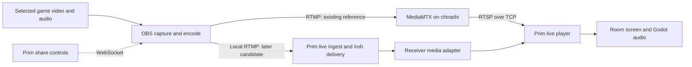

# Livestream capture and control research

Research and proposed sequence, 2026-09-17. This is a planning note, not an
implementation commitment. No capture, stream, service, or configuration was
started or changed for this research.

## Recommendation and scope

Start with **Prim controlling the existing OBS installation**, and use the
existing **OBS → chirashi MediaMTX → RTSP/TCP → player** setup as the reference.
The user reports sub-second latency with this exact class of path in VRChat's
embedded AVPro player. The first experiment should therefore establish Prim
receiver parity, rather than re-proving whether RTMP ingest and RTSP/TCP can
support the desired latency.

User choices for the first prototype:

- A separately installed OBS is acceptable.
- Only the room host needs to publish initially; one shared screen at a time.
- Qualify the user's current Linux desktop first, then Windows 11 and Windows 10.
- Start at 720p60, with 1080p60 optional.
- Stream a game window and its audio to 2–5 other people, excluding Prim audio.
- Keep this at research/planning depth; implementation can wait.

Three decisions can progress independently: capture UX, live playback, and room
delivery. Improving capture UX does not require settling MoQ versus WebRTC, and
testing live delivery does not require replacing OBS.

## Current evidence

Read the current dirty worktree at HEAD `015ce98`, including
`project/media/playback.gd`, `native/src/media/`, the libmpv-zero wrapper, and
the existing direct-media and experience-continuity plans. Existing work was
left untouched.

- Prim already renders libmpv video and routes movie audio through Godot.
- Playback snapshots recognize `url`, `file`, and `peer_file`; drift correction
  seeks toward a host movie position. This needs an explicit live mode.
- The mpv initialization does not select a low-latency profile. The Godot audio
  bridge accounts for queued samples and downstream output delay, which gives
  useful instrumentation for the receiver experiment.
- Current file sharing separates provider and room authority, and uses dedicated
  authenticated Iroh media delivery. Reuse membership, lifecycle, and relay
  policy; a live stream needs different buffering and scheduling from file ranges.
- The current desktop is niri, verified from running processes and NixOS config.
- Saved local OBS profiles use x264 at 60 fps with unusual tall output canvases.
  The `game` collection contains PipeWire screen capture and PulseAudio output
  capture. Saved obs-websocket configuration has the server disabled and
  authentication enabled. These are configuration observations, not a fresh
  recording or streaming test.
- The user has working local OBS recording and MediaMTX on chirashi with RTMP
  ingest and RTSP/HLS output. The user additionally reports sub-second RTSP/TCP
  playback in VRChat. That working setup should be preserved as a comparison.

## OBS can provide most of the desired UX

OBS has included obs-websocket since version 28. Its API can create sources,
query selectable source properties, change settings and destinations, start/stop
streams, and report status. This supports a Prim-owned share panel without
requiring routine visits to the OBS interface. Source settings are plugin- and
platform-specific, so qualify a small set of source kinds rather than assuming
one universal window selector. [Remote control](https://obsproject.com/kb/remote-control-guide),
[API protocol](https://github.com/obsproject/obs-websocket/blob/master/docs/generated/protocol.md).

Proposed flow: **Share game → select video and game audio → preview → Start**.
Prim launches or connects to OBS, selects its managed profile/scene collection,
configures the destination, and reports capture/output state. Stop ends the
share while the party stays connected. Initial pairing may require enabling
authenticated remote control once; eliminating that setup is a later packaging
question. Detect an active unrelated OBS stream/recording before taking control.

CLI options select profiles/collections/scenes, minimize the app, and start
streaming. They are useful for launch; WebSocket is the better ongoing control
interface. Minimized OBS still runs its normal application lifecycle. Windows
has official portable mode, but OBS documents portable mode as unsupported on
Linux: qualify Linux configuration isolation and plugin discovery separately.
A distinct profile alone is not complete process/configuration isolation.
[Launch options](https://obsproject.com/kb/launch-parameters),
[portable mode](https://obsproject.com/kb/portable-mode).

Use a dedicated Prim profile/collection and explicit ownership of the helper
session. Keep control credentials and ingest capabilities out of diagnostics.
Do not overwrite the working VRChat setup. Eventually a managed OBS package can
remove the separate-install step while keeping the same control adapter.

### Wayland and niri

The normal portable Linux path is ScreenCast portal → PipeWire. The portal
advertises supported source types and may remember consent using rotating
restore tokens; restoration can fail and require selection again. A native
picker is part of the intended flow, rather than an OBS settings chore.
[ScreenCast API](https://flatpak.github.io/xdg-desktop-portal/docs/doc-org.freedesktop.portal.ScreenCast.html).

Niri supports monitor and individual-window capture through its GNOME portal
backend. It also offers a **Dynamic Cast Target**: select it once, then switch
the target through compositor actions/IPC. This is a promising optional local
shortcut for “share this game.” All dynamic casts share a target, so it needs
coordination with other casting apps and should not define the cross-platform
contract. [Niri screencasting](https://niri-wm.github.io/niri/Screencasting.html).

Upstream OBS's PipeWire source saves restore tokens and exposes a `Reload`
properties button. WebSocket's properties-button operation therefore looks
suitable for requesting the picker again, but the complete call/portal UX must
be tested on the installed OBS and niri versions.
[OBS source](https://github.com/obsproject/obs-studio/blob/master/plugins/linux-pipewire/screencast-portal.c).

### Game audio is an independent requirement

The video portal does not automatically supply the selected application's audio.
Prefer a positive selection of the game's audio stream/process, preserving the
player's local hearing. Prim voice, microphone, and movie playback should stay
outside the outgoing stream. The streamer should not hear a delayed second copy
of their own game through the receiving player.

- **Windows:** OBS documents application audio capture on Windows 10 2004+ and
  Windows 11, and an audio option on window/game capture from OBS 30.1.
  Qualify representative Windows 10 builds and games separately.
  [OBS application audio](https://obsproject.com/kb/application-audio-capture-guide).
- **Linux:** the PipeWire audio-capture plugin supports applications; its upstream
  inclusion remains a draft PR at research time. Treat it as a real dependency,
  not a feature every stock OBS install has. A game-only virtual sink with local
  monitoring is a fallback. [Plugin](https://github.com/dimtpap/obs-pipewire-audio-capture),
  [upstream PR](https://github.com/obsproject/obs-studio/pull/6207).

Window-to-audio matching needs care with Proton, launchers, subprocesses and
multiple game instances. For the prototype, a separate audio-app selector is
acceptable when automatic matching is uncertain. Verify isolation while other
people speak and Prim plays a test sound. Capturing a game's entire audio also
captures voice chat mixed inside that game; separating that would require game
support or separate audio streams.

## Other frameworks and where they fit

These are engineering assessments based on the linked APIs, not measured
performance rankings.

| Option | Useful capability | Fit for Prim |
| --- | --- | --- |
| **libobs helper** | OBS's core is a reusable library with capture, encoder and output modules; an application can supply its own frontend. | Strongest next candidate if the full OBS application becomes the UX/package bottleneck. Keep it in a supervised helper process, with selected modules. Still requires source properties, GPU setup, device changes and packaging. [Frontend API](https://docs.obsproject.com/frontends), [modules](https://docs.obsproject.com/plugins). |
| **GStreamer helper** | Windows D3D11/WGC capture, process-audio loopback, hardware encoders and pipeline composition. Linux can consume PipeWire streams. | Credible alternative for a tightly controlled capture→encode pipeline. Prim still supplies portal/session handling, target/audio selection, recovery and platform qualification. Windows process-loopback documentation specifies build 20348, so do not assume parity with OBS's Windows 10 support. [Video source](https://gstreamer.freedesktop.org/documentation/d3d11/d3d11screencapturesrc.html), [audio source](https://gstreamer.freedesktop.org/documentation/wasapi2/wasapi2src.html). |
| **FFmpeg/libavcodec** | Encoding, conversion and muxing; Windows `ddagrab`, and current upstream `gfxcapture` for WGC window/monitor capture. | Useful plumbing and test tools. Exact filters and hardware paths depend on the build. Wayland permissions, per-app audio and lifecycle remain integration work. [Filters](https://ffmpeg.org/ffmpeg-filters.html#gfxcapture). |
| **Browser / libwebrtc** | Browser sharing APIs and native desktop-capture backends; an established realtime media stack. | Attractive if Prim adopts WebRTC delivery too. Extracting browser capture is not extracting a small FFmpeg wrapper. Browser UI requires user activation and repeated permission; audio availability varies. [WebRTC capture source](https://webrtc.googlesource.com/src/+/refs/heads/main/modules/desktop_capture/desktop_capturer.h), [browser API](https://developer.mozilla.org/en-US/docs/Web/API/MediaDevices/getDisplayMedia). |
| **scap** | Rust capture abstraction over Windows Graphics Capture, Linux PipeWire and macOS ScreenCaptureKit. | Worth a bounded native-capture comparison later. It is not an end-to-end capture/audio/hardware-encode/network solution; evaluate frame ownership/copies and each backend before choosing it. [Project](https://github.com/CapSoftware/scap). |
| **WayVR / Desktop+** | WayVR has a separate `wlx-capture` crate; Desktop+ uses desktop duplication and Windows Graphics Capture. | Valuable references or focused reuse for texture capture/overlay work. They do not supply the complete game-audio→encoder→party-delivery feature. [WayVR capture](https://github.com/wayvr-org/wayvr/tree/main/wlx-capture), [Desktop+](https://github.com/elvissteinjr/DesktopPlus). |
| **Sunshine / Moonlight** | Mature game-streaming host/client stack and hardware encoding. | Useful performance/implementation reference. This is a GameStream stack with its own sessions, control and media handling, not a generic RTMP endpoint for mpv. Reusing it brings substantial client/host integration beyond the initial spectator use case. [Sunshine](https://github.com/LizardByte/Sunshine), [Moonlight core](https://github.com/moonlight-stream/moonlight-common-c). |
| **Spout** | Local GPU texture/frame sharing on Windows; VRChat's camera supports it, including PCVR. | Excellent optional source for a clean spectator camera. OBS can receive it through a plugin and keep the rest of the pipeline unchanged. Spout itself supplies neither game audio, encoding, nor internet delivery. [SDK](https://github.com/leadedge/Spout2), [VRChat support](https://docs.vrchat.com/docs/vrchat-202433-openbeta). |

The embedded libmpv and its FFmpeg dependencies do not establish an available
capture/encoding API in Prim. Reusing compatible libavcodec libraries may reduce
some duplication later, but needs explicit build/API work. Prefer keeping raw
frames and encoding together in the capture helper; move compressed media across
process boundaries. GPU texture capture alone does not prove a zero-copy path
through conversion and the chosen encoder.

## Playback and delivery

RTMP ingest carries encoded media continuously; it does not require waiting for
HLS-sized segments. Keep the existing RTSP/TCP reference. Compare HLS only as a
compatibility path, without making broad claims that TCP cannot meet sub-second
latency: the user's existing setup already does.

For Prim, live playback should follow a bounded delay behind the newest media.
Disable movie pause/seek/drift behavior for that source kind, preserve media
timestamps for A/V sync, bound every queue, and recover at a decodable keyframe
when too far behind. A slow viewer must not accumulate minutes of backlog or
stall the other viewers. Source generations, stop/restart, late join, failure
and UI state still belong to Prim room control.

Start receiver tuning from the bundled mpv version's `low-latency` profile and
inspect the actual options; do not assume upstream defaults match the fork.
Measure demux, decoder, video presentation, Godot audio and OS output delay.
Avoid globally changing movie playback, and do not casually use `untimed` on
audio/video streams. [mpv low-latency guidance](https://mpv.io/manual/master/#low-latency-playback).

Retain **MoQ over Iroh as a candidate**, consistent with the existing direct
media plan. Current moq-dev tooling can import OBS RTMP and export RTMP to mpv,
which makes a receiver remux bridge plausible without replacing decoding.
However, its Iroh transport is explicitly experimental. Authenticate membership,
bound queues, preserve selected-path relay consent, and pin wire/codec versions.
The stock RTMP CLI ignores stream keys and is unauthenticated; a product must
enforce its publisher policy. [RTMP gateway](https://doc.moq.dev/bin/rtmp),
[transport status](https://doc.moq.dev/concept/transport).

The MoQ docs recommend media relays for internet fanout. This does not imply
Iroh cannot form direct WAN paths. Test Prim's small mesh both directly and
through relays; an opaque Iroh packet relay does not turn five outgoing copies
into one. WebRTC is the fallback to evaluate if WAN adaptation/recovery requires
too much new media machinery. Preserve the working RTSP reference while making
that decision.

There is also an **OBS MoQ plugin**, including encoder latency policy and
publishing through OBS encoders. It may eventually remove local RTMP bridging,
but its documented relay integration is not proof of drop-in Prim/Iroh support.
Keep it optional until the native receive/transport experiment earns it.
[Plugin documentation](https://doc.moq.dev/bin/obs).

Encode once for the initial quality profile. With direct fanout, five viewers
at a hypothetical 4–6 Mbit/s video bitrate need roughly 20–30 Mbit/s uploader
capacity, plus audio and overhead. A media server can instead receive one upload
and fan out at server egress. Keep that deployment choice separate from capture;
the chirashi reference is useful without becoming a mandatory service.

## Proposed sequence and stopping points

1. **Receiver parity with the working reference.** Use the known OBS stream and
   chirashi RTSP/TCP output. Compare Prim with the known AVPro result and, if
   helpful, standalone mpv using the same media. Establish an explicit live
   playback mode and identify any added Prim delay. Keep known-good encoder
   settings until there is a reason to change them.
   **Exit:** sub-second capture-to-display on the tested path, stable A/V, and no
   VOD correction fights. Report startup/keyframe wait separately from steady
   delay. The session ends here if this is enough evidence to defer further work.

2. **Automated sharing on niri.** Add the thin OBS controller and managed profile
   with a 720p60 target, system video picker, game-audio selection, preview,
   start/stop and useful error state. Use the existing server path so capture UX
   has only one new dependency at a time. Test source closure, game restart,
   resizes, minimized windows and OBS exit. Explore Dynamic Cast Target only as
   an optional shortcut.
   **Exit:** repeated sessions require no OBS navigation beyond one-time setup;
   outgoing audio contains the game and excludes Prim, with local game hearing
   intact. Existing OBS profiles continue to work.

3. **The same workflow on Windows.** Use OBS window capture first, game capture
   where appropriate, and application audio. Qualify Windows 11, then specific
   Windows 10 versions. Include a normal desktop game and a VR mirror; measure
   game/headset frame-time impact and hardware-encoder availability. A success
   under Wine is not native capture or headset evidence.
   **Exit:** the same user flow and audio isolation work on both target OSes.
   This establishes whether maintaining OBS automation is already sufficient.

4. **Private room delivery, 2–5 viewers.** Introduce local ingest and compare the
   Iroh/MoQ candidate with the RTSP reference. Exercise LAN, direct WAN, forced
   relay, changing bandwidth, loss, late join, publisher restart and a slow
   viewer. Keep video bytes off the room's control/voice queues, pace upload,
   and observe voice quality while streaming. If fixed quality is insufficient,
   decide explicitly between a second rendition, server fanout/transcoding, and
   a mature adaptive stack; bitrate changes are not assumed instant or portable
   through stock OBS control.
   **Exit:** measured steady latency and bounded recovery with all viewers,
   without degrading conversation. Use a proposed healthy-path p95 below one
   second, and document the loss/bandwidth envelope separately.

5. **Decide how much OBS to hide or replace.** If startup, installation or process
   lifecycle is the remaining problem, evaluate a managed OBS distribution or
   small libobs helper first. Compare GStreamer/native capture only against a
   specific unmet requirement. Add Spout as another source without redesigning
   delivery. Defer simultaneous shares, HDR, remote input and overlay integration
   until the basic experience is useful.

Across these stages, measure capture-to-screen delay with a visible timecode or
flash pattern, audio alignment with a synchronized pulse, and latency growth over
several minutes. Report median/p95, first-picture time, recovery time, game
frame-time impact, GPU/CPU use, upload and voice quality. Proposed numbers and
API-based feasibility in this note are not new benchmark results.
