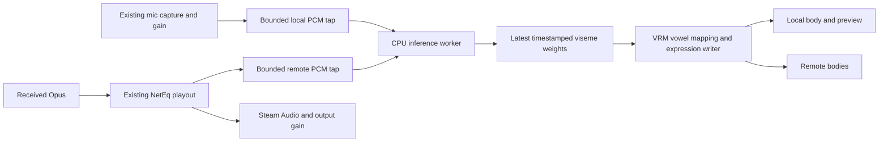

# Voice-driven visemes

Research and implementation record, 2026-09-13. The initial implementation is now in the working tree. The status below supersedes the original design and acceptance checklist that follow.

Use the **streaming OpenLipSync model shipped inside Basis**, run on the CPU in
Prim's Rust extension. Analyze each remote speaker's decoded playout audio and
the local user's existing microphone capture. Map the model's 15 outputs to the
five vowel expressions already present in Alicia and Vita, with conservative
consonant approximations and priority for authored Oculus viseme shapes.

This fits the existing six-person Linux/Windows desktop and PCVR theater. It
requires neither face-tracking hardware nor a voice/pose protocol change.

## Implemented status

- `native/src/viseme/`: paired Rust mel frontend, rational-clock 48-tap resampler,
  streaming ONNX inference and one CPU worker serving at most six independent
  speaker contexts. The model/config/licenses are pinned under
  `native/viseme-model/`; ONNX Runtime 1.26.0 CPU binaries are hash-pinned by
  `tools/fetch-viseme-runtime.py` for Linux and Windows x86-64.
- GNA's `gdext/src/pcm_tap.rs` adds opt-in fixed-block, nonblocking audio taps.
  Local input is the gained capture PCM; remote input is PCM actually consumed
  after NetEq, before spatialization/receive gain. No new wire messages or second
  microphone capture. Inference never runs on the audio or render thread.
- Each tap holds 128 blocks of at most 480 samples. This accommodates Godot's
  many small playback-resampler fragments; it is a capacity bound, not a target
  buffering delay. The worker discards blocks older than 100 ms and resets on
  generation/sample gaps or rate changes. Results expire at 150 ms. Mute resets
  the local generation immediately; leave/removal drops speaker state.
- One ORT session shares model weights; each speaker owns its caches and frontend.
  ORT intermediate/output allocations remain on the worker in this version;
  preallocated ping-pong inference buffers are a possible optimization, not an
  achieved guarantee. `get_stats()` exposes hops, dropped samples, result age,
  sample position and maximum processing time per block.
- `project/avatars/expressions.gd` writes instance blendshape values only. It
  extracts declared VRM vowel bindings without playing eye-rotation tracks,
  prioritizes case-insensitive raw `vrc.v_*` / `viseme_*` shapes, clamps combined
  deformation and applies a single exponential smoothing stage. Empty/stale
  results restore the saved neutral values. Arbitrary VRM 1 expression override
  rules, facial tracking, model selection/loading and extension extraction remain
  outside this pass.
- Missing inference runtime reports one diagnostic and leaves mouth animation
  neutral while voice continues. Both packaging tools require/stage the runtime
  and readable upstream notices.

### Additional reference findings

The user's `natto:~/code/gLipSync` at `4b802d8` is a Rust/Godot uLipSync port
with MFCC profile matching, normalized volume and SmoothDamp. Its profile-based
recognizer is not reused: OpenLipSync requires its own paired frontend. The
separation between background analysis and main-thread expression smoothing was
useful reference.

[CATS viseme generation](https://github.com/absolute-quantum/cats-blender-plugin/blob/master/tools/viseme.py)
builds missing consonants from weighted source mouth shapes. Prim uses the same
general technique with independently chosen conservative vowel mixtures, without
copying GPL Blender code or its coefficient recipe. For example, missing SS uses
0.45 of the ih expression. Missing PP/silence closes to neutral. This adds some
variation but cannot create absent tongue, teeth or lip-contact geometry.

Read-only JSON inspection of the private local test VRMs found:

| File | Raw shapes / declared groups | Implication |
| --- | --- | --- |
| `/mnt/s/Downloads/hiibcot2_v6.vrm` | All 15 lowercase `vrc.v_*` shapes on `Body.baked`; empty VRM blendShapeGroups | Raw-name lookup is necessary and preserves the full set. |
| `/mnt/s/Downloads/testsana.vrm` | Five `vrc.v_aa/ih/ou/e/oh` shapes and standard VRM groups | Still limited to vowel geometry. |

The initial audit did not copy or import either private model. A later local
comparison helper now imports `hiibcot2_v6.vrm` into a disposable `.local` project,
with separate settings and networking disabled. All 15 authored shapes survive
that import; a switch compares five-vowel approximations on the same geometry.
Neither model is in the normal project or distribution. General user-model
loading remains deferred; see the private comparison instructions in AVATARS.md.

### Validation completed

- Rust formatting, native tests and Clippy; GNA workspace formatting, Clippy,
  check and tests. On this Nix host the unrelated codec-bench Opus CMake build
  installed into `lib64` while its build script expected `lib`; a local build-cache
  `lib -> lib64` symlink allowed the full workspace checks to run.
- Independent NumPy frontend plus Python ORT comparison on real LibriSpeech test
  speech at 16/44.1/48 kHz: maximum active-band mel error below 0.002 dB and maximum
  weight error below 0.000005. Chunk-boundary invariance is tested separately.
- Six-context speech test through real sender/Opus/NetEq playback taps: varied
  visemes, finite output, zero tap overflow, reset/expiry/removal and independent
  contexts. Missing-runtime behavior also passed.
- Two- and six-process Linux integration: voice/media/avatars plus local and
  remote viseme advancement, 700 ms main-thread stall, swaps and mute closure.
- Linux package and Windows cross-built package under Wine both passed the
  speech/viseme harness using their bundled official ORT runtime.
- Rendered neutral, aa and approximated SS poses for both bundled avatars were
  inspected. Reproduce with `tests/viseme_preview.gd` (columns in that order;
  Alicia above Vita).
- On this Ryzen 7 9800X3D, the initial debug six-context CPU probe was about
  3.05 ms p95 / 3.42 ms p99 per 10 ms of input. This is a short local measurement,
  not a minimum-spec guarantee or a measured audiovisual synchronization offset.

Remaining manual qualification: conversational speech/noise and mouth/audio
alignment in-headset, lower-end CPUs, and native Windows PCVR. Automated model
parity and pose screenshots do not establish perceptual lip-sync quality.

## Research findings

| Candidate | Current evidence | Decision for Prim |
| --- | --- | --- |
| OpenLipSync, original | [Upstream](https://github.com/KyuubiYoru/OpenLipSync) was archived on February 18, 2026. Resonite [integrated it in September 2025](https://wiki.resonite.com/Beta_2025.9.23.1237), including a native Linux alternative to OVRLipSync. | The user's recollection is correct, but don't start from the archived implementation. |
| Basis's embedded OpenLipSync | The current [`com.basis.openlipsync` package](https://github.com/BasisVR/Basis/tree/developer/Basis/Packages/com.basis.openlipsync) is version 0.2.0, with a cached streaming TCN, updated feature preprocessing, and per-speaker state. | Preferred model and reference implementation; port the small inference pipeline rather than importing Unity/.NET. |
| uLipSync | [MIT, MFCC/profile matching](https://github.com/hecomi/uLipSync); supports microphone input and calibration. Its documentation recommends recording phoneme examples into profiles. | Credible lightweight alternative, but profile calibration is extra friction for casual multiplayer. |
| HeadAudio | [MIT, dependency-free browser implementation](https://github.com/met4citizen/HeadAudio), MFCC/Gaussian classification with 15 Oculus-style outputs. Documents roughly 50–100 ms processing latency and limitations with noise. | Useful second opinion if the neural model fails qualification; needs a native port and has no demonstrated quality advantage here. |
| `tobyapi/lip_sync` | [Rust/C ABI, nine classes and a VRM mapper](https://github.com/tobyapi/lip_sync), profile-free spectral heuristics. The checked-in [trained GMM arrays are empty](https://github.com/tobyapi/lip_sync/blob/main/src/trained_band_gmm.rs). | Convenient architecture, but not evidence of a better pretrained recognizer. Do not mistake its optional model infrastructure for validated speech accuracy. |
| Existing Godot integrations | [`real-time-lip-sync-gd`](https://github.com/virtual-puppet-project/real-time-lip-sync-gd) describes a Rust uLipSync port, last pushed in 2023. [`goatchurchprime/lipsync`](https://github.com/goatchurchprime/lipsync) uses TwoVoIP/OVRLipSync on Windows/Android and a volume fallback elsewhere. | Neither is a drop-in match for Prim's Godot 4.7/Rust/GNA/Linux path. |
| NVIDIA Audio2Face-3D SDK | [Windows/Linux SDK](https://github.com/NVIDIA/Audio2Face-3D-SDK) now exists, but requires NVIDIA CUDA/TensorRT and targets richer facial output. | Too much GPU/platform and packaging cost for this five-vowel, six-person feature. |
| Rhubarb / OpenFaceFX | [Godot baked lip sync](https://github.com/fbcosentino/godot-baked-lipsync) handles recordings; [OpenFaceFX streaming](https://github.com/OpenFaceFX/OpenFaceFX#streaming--real-time-generation) consumes timed phoneme segments. | Useful for authored dialogue/TTS, not the direct live-microphone analyzer needed here. |

No inspected alternative establishes better quality for Prim's use case. This
is a fit recommendation, not an A/B quality result. Real voices, microphone
noise, accents, and Opus compression remain qualification work.

### Reproducible Basis reference

The reference is `/mnt/s/code/Basis` (capital B), at
`a59efeb2ec20938702b97c42b0a08ffd860eba3b`. The inspected lip-sync package and
common driver paths were clean. Its model/configuration and streaming frontend
are substantially newer than the separate `BasisVR/OpenLipSync` fork, whose
last GitHub push was February 18, 2026. The current Basis `developer` versions of
`config.json`, `StreamingSession.cs`, and `MelSpectrogramProcessor.cs` were
fetched and matched this checkout byte-for-byte.

Pin the package files from this Basis revision, not an unversioned fork download:

- Model: `Basis/Packages/com.basis.openlipsync/OpenLipSync/model.onnx.bytes`.
  Size: **10,705,002 bytes**, SHA-256
  `02f2dd6825652fd3d86f7777825cc0af7d8335f064984eeeceb42540fe7d9804`.
  Last commit touching this path: `e31328a9d25202a2802e156c8b7075ea06d29a17`.
- Frontend: `Runtime/Ported/Audio/{AudioResampler,MelSpectrogramProcessor,FFTProcessor}.cs`.
- Inference: `Runtime/Ported/{StreamingSession,AudioContext,OpenLipSyncBackend}.cs`.
- Lifecycle/reference: `com.basis.framework/Drivers/Common/BasisOpenLipSyncContext.cs`,
  `BasisAudioAndVisemeDriver.cs`, and `Drivers/Remote/BasisRemoteAudioDriver.cs`.

The [model configuration](https://github.com/BasisVR/Basis/blob/developer/Basis/Packages/com.basis.openlipsync/OpenLipSync/config.json)
specifies 16 kHz mono, a 400-sample symmetric Hann window, 160-sample hop,
1024-point FFT, 80 HTK mel bands spanning 50–8000 Hz, and raw log-power dB input.
Normalization is inside the graph. Each step consumes `[1,1,80]` plus ten
convolution caches and produces 15 logits plus new caches. Apply sigmoid once;
these are multi-label weights, not a softmax distribution. The declared lookahead
is 20 ms; the 157-frame receptive field is history, not a 1.57-second startup wait.

Use the paired model/frontend as a unit. Do not independently substitute common
librosa defaults, double-normalize the mel features, softmax the outputs, or
reintroduce older probability boosts. Verify graph I/O and output activation
against the actual ONNX file in the spike. Comments mentioning 128 channels,
91 MMAC/s, or an 83× speedup describe earlier versions: the current config lists
256 channels and 2,653,440 MAC per hop. That implies about 265 MMAC/s per source,
or 1.59 GMAC/s for six continuously active sources, before frontend overhead.
These are configuration-derived operation counts, not measured CPU timings.

The package's [notices](https://github.com/BasisVR/Basis/blob/developer/Basis/Packages/com.basis.openlipsync/THIRD_PARTY_NOTICES.md)
identify Apache-2.0 for the code/model, MIT for ONNX Runtime, and LibriSpeech
CC BY 4.0 training-data attribution. Preserve the relevant licenses, attribution,
source SHA, model hash, and an explicit record of the Rust port. The notice's
architecture description is stale; use the pinned graph/config for that detail.

## Prim and FPSloppa findings

Inspected Prim `0f6345c038efe44af94cdc606ea717072394bde3`, with GNA at
`5ba002f9ebbe4baf8e513a31ab33d403492442fa`. FPSloppa is at
`a873edbc452c4982ceac48cf963374c4b9c986f7`.

| Existing boundary | Consequence |
| --- | --- |
| `project/main.gd`: `NetworkAudioSender`, worker capture, microphone gain/device selection | Reuse capture ownership. Do not introduce a second microphone reader. |
| GNA `gdext/src/sender.rs::worker_loop` | Has mono, gained/clamped PCM immediately before `VoiceEncoder::push_pcm`; this is the local analysis source. Capture can use the device's sample rate. |
| GNA `gdext/src/stream.rs::fill_output_frames` | NetEq produces 48 kHz mono in 480-sample pulls, then copies it into playback output. Tap the consumed output, retaining NetEq ownership on the audio thread. |
| `project/net/avatar.gd` | Keeps the stream and Steam Audio head anchor alive across avatar changes; speaking status only counts non-silent output frames. Preserve that lifecycle. |
| `project/avatars/driver.gd` | Owns the instantiated VRM and render layers, but currently has no facial-expression writer. |
| `project/main.gd::rebuild_local_avatar` | Replaces the local model on avatar/height changes. Analysis state must live outside this replaceable mesh. |

There is no public PCM-analysis tap in GNA yet. Also, its current encoder has no
implemented denoiser: do not describe this source as noise-suppressed or plan
around a nonexistent VAD callback. Use the actual PCM, mute/capture lifecycle,
and bounded silence handling.

FPSloppa does have visemes:

- `deathmatch/voice/visemes.gd` estimates five vowel weights from RMS and six
  Goertzel frequency probes over 16 kHz mono. It is a small acoustic heuristic,
  with a nonzero A bias during activity, not OpenLipSync or phoneme recognition.
- `deathmatch/avatars/mouth.gd` resolves VRM expression animations into declared
  mesh/blendshape bindings, sums shared bindings, smooths attack/release, and
  expires stale targets. This is the useful code pattern to adapt.
- `deathmatch/voice/chat.gd` manages mouth targets and expiry. Its TwoVoIP/ENet
  audio plumbing is not Prim's transport/playout path.

Both original VRM assets declare A/I/U/E/O groups. A temporary read-only Godot
4.7.2 inspection also instantiated both current imports and resolved all ten
`aa/ih/ou/ee/oh` blendshape tracks successfully. Alicia uses
`bs_face.mouth_{a,i,u,e,o}`; Vita uses `Face...Fcl_MTH_{A,I,U,E,O}`.
The imported vowel animations **also contain eye-rotation tracks**. Therefore,
extract only `Animation.TYPE_BLEND_SHAPE` bindings; playing entire vowel
animations would write unrelated eye state. No full standardized 15-viseme set
is declared by either avatar. Alicia has extra mouth morphs, but any use of those
needs an explicitly reviewed per-avatar mapping.

## Proposed runtime design

### Audio tap and scheduling

Add a small optional native PCM tap to GNA's Godot integration. Keep ONNX,
model files, and VRM semantics in Prim; `voice-core` remains sans-IO.
The tap publishes fixed-capacity blocks containing mono samples, actual sample
rate, a source sample counter, monotonic timing, and a generation/discontinuity
marker. Expose a Rust handle for Prim, rather than per-block GDScript signals or
main-thread `PackedFloat32Array` transfers. Cover both device capture and the
existing injected-PCM test path.

Remote PCM must come **after** NetEq's jitter handling, PLC and time stretching,
and **before** HRTF, reverb, listener gain and distance attenuation. Copy only
the samples actually consumed into the stream output; don't analyze a second
decode or use packet-arrival time as the animation clock. This keeps mouth
movement tied to the heard utterance through loss and jitter. It also keeps
mouth motion independent of the listener's volume slider, matching today's
speaking indicator. Movie audio never enters this tap.

The audio callback only copies into a preallocated, nonblocking queue. No new
inference, resampling, allocations, waiting locks, or Godot scene access there.
The microphone worker similarly enqueues without waiting for inference, so
visemes cannot delay encoding or packet transmission.

Start with one dedicated worker, one shared immutable model/session, and at most
six separate source contexts. Each context owns its resampler, mel history,
convolution caches and smoothing state. Run ORT sequentially with one intra-op
thread initially; do not multiply hidden thread pools across speakers. Keep
contexts warm for the small room instead of porting Basis's large-lobby pool.
Benchmark before deciding whether a second worker is justified.

Bound pending audio to roughly 100 ms per source. On overrun, the producer
records dropped samples without blocking; the consumer discards stale backlog,
increments the generation, and resets signal/inference history. Never replay
old mouth movements to catch up. Use a bounded, synchronized latest-result
handoff; Basis's double-buffer assumption of at most one publish per render
frame is not automatically safe for Prim's independent 100 Hz worker.

Expose only a compact result such as `weights[15]`, source/sample timing,
generation, and availability to GDScript. Add diagnostics for tap drops, queue
age, inference duration and stale-result resets. Keep local and each peer's
state separate, including after slot reuse or reconnect.

### Timing, silence and lifecycle

The model's 20 ms lookahead is only part of the delay. Resampling/windowing,
worker scheduling, smoothing, render cadence, and Godot/Steam Audio output
buffering also matter. Timestamp features/results in the source clock and
measure audiovisual timing against captured playback, not just inference speed.
Do not add voice delay in the first implementation. If perceptual sync fails,
measure which stage is responsible before proposing buffering changes.

Initialize all mouths at neutral. Short zero/PLC segments advance the model
normally; explicit end/pause and prolonged inactivity close the mouth and allow
analysis to sleep. Before waking after a discontinuity, reset resampling,
feature history and caches. Distinguish a fresh silent result from a worker
that stopped publishing: if the newest result is over 150 ms old, release to
neutral, with a proposed complete closure within 250 ms of source termination.
Tune these bounds during real-speech validation.

Muting or capture failure closes the local mouth immediately and discards pending
local results. Remote end-of-talkspurt closes after queued playback drains;
disconnect/deactivation closes immediately. A replaced model binds the latest
fresh result or neutral without restarting voice. Retired stream generations
cannot write into a replacement peer or avatar. Pose-only resets/recalibration
do not need to restart healthy audio analysis.

Preserve Prim's current microphone policy: muted on startup, capture stopped
when muted, and normal unmute requires a room connection. Opening the avatar
preview must not activate the microphone. The first local viseme path works
while connected and unmuted; offline review uses prerecorded test audio.

### Expression application

Add a small `project/avatars/expressions.gd` owned by `PrimAvatarDriver`. On
configuration, resolve the imported animation library's declared blendshape
bindings, including VRM 0 aliases and all applicable mesh instances. Cache those
bindings once per instance; do not guess indices from raw mesh names.

Use one expression writer so future blinking, emotes and face tracking can
compose without overwriting the same morph. Initially it owns only mouth
bindings. Preserve authored weights, reject non-finite input, accumulate shared
bindings, clamp the final result, and restore the known neutral values on reset.
Never mutate shared mesh/animation resources. If richer VRM 1 expressions are
added, implement [`overrideMouth` and binary-expression rules](https://github.com/vrm-c/vrm-specification/blob/master/specification/VRMC_vrm-1.0/expressions.md)
at this boundary; the bundled vowel groups are continuous morph-only bindings.

Keep 15 weights through inference. The initial mapping is:

| OpenLipSync output | Bundled VRM target |
| --- | --- |
| `aa`, `ih`, `ou`, `E`, `oh` | `aa`, `ih`, `ou`, `ee`, `oh`, respectively |
| `sil`, `PP` | Rest/closure evidence, attenuating open vowels when dominant |
| `FF`, `TH`, `DD`, `kk`, `CH`, `SS`, `nn`, `RR` | No authored direct equivalent; use only short, bounded vowel continuity initially |

Treat this as an authored approximation, not a lossless conversion. Preserve
graded vowel output; cap excessive combined deformation after mapping rather
than normalizing all 15 multi-label predictions. Tune silence/PP dominance and
the short consonant transition in the visual fixture. Keep one principal
smoothing stage, with render interpolation only as needed; don't stack the
Basis smoother and FPSloppa's full attack/release filter without measuring lag.

True F/V, tongue, and other consonant shapes require additional artist-authored
bindings/morphs. They are a later asset improvement, not a prerequisite for
useful voice-driven animation on today's avatars. Unknown/fallback box avatars
retain the speaking indicator and safely omit mouth animation.

### Native runtime and packaging

Implement inference in `native/src/viseme/` behind a small internal interface.
Use an exactly pinned Rust `ort` version with the CPU execution provider and
an exactly pinned ONNX Runtime release. Its documented
[`load-dynamic` mode](https://github.com/pykeio/ort/blob/main/docs/content/setup/linking.mdx)
allows an explicit runtime-library path. Qualify Linux and Prim's
`x86_64-pc-windows-gnu` build early; the Windows C ABI loading path should be
tested rather than assuming MSVC import libraries work with the current build.

Vendor model/config/licenses together under a focused dependency directory and
embed model/config bytes once in `prim_native`. This avoids depending on Godot's
export filters for raw `.onnx` assets; current presets explicitly include only
`private_lobby.json` outside imported resources. A future external model asset
layout would need explicit export coverage instead.

Explicitly seed `libonnxruntime.so`/`onnxruntime.dll` and their runtime dependencies
in the Linux/Windows packagers: runtime-loaded libraries are invisible to normal
ELF/PE import discovery. Resolve the bundled library path relative to the
package, not a developer's shell. Do not copy Unity's managed DLLs. The inspected
Basis package does not supply a Linux desktop ORT binary, so obtain/build a
pinned CPU runtime independently. Include its notices and transitive libraries.

Missing/incompatible ORT or a model-load failure must leave voice and avatars
usable with neutral mouths and one clear diagnostic. Prove that failure mode
in a packaged test; do not assume every wrapper initialization error is benign.
No runtime model download or cloud service is needed.

## Implementation sequence and acceptance gates

1. **Qualify the model and frontend in isolation.** Make a small Rust CLI/harness
   that streams a licensed speech fixture through the pinned model. Compare its
   resampling, mel features, logits, and state reset against the paired reference
   at 16/44.1/48 kHz and varied chunk boundaries. Check all graph shapes and the
   activation contract. Compare real speech visually against FPSloppa's heuristic
   with identical audio and avatar mapping. Include multiple speakers, soft/loud
   speech, silence, fricatives, plosives and room noise. Model-reported training
   scores and synthetic sine waves are not a mouth-quality acceptance test.
2. **Add expression binding and a review fixture.** Drive known vowel weights on
   Alicia and Vita, show neutral and all five vowels, then play the same speech
   fixture. Check two simultaneous instances, preview/remote layers, summed
   bindings, neutral restoration, and that eye tracks remain untouched. Start
   with the documented mapping; refine only from visible results.
3. **Add optional GNA taps and source lifecycle.** Test consumed PCM order,
   sample-rate metadata, discontinuities, overflow, stopped/paused streams,
   injected input, and capture restart. Disabled taps retain existing behavior.
   Keep NetEq on the playback side. Changes belong in the public GNA dependency;
   update Prim's gitlink after the focused dependency work is ready.
4. **Wire live local/remote inference.** Introduce source attachment/removal in
   `native/src/session.rs` or a small dedicated controller; consume results in
   `project/main.gd` and `project/net/avatar.gd`, applying through the shared
   avatar driver. Test avatar/height swaps while speaking, mute/unmute,
   disconnect/reconnect, stale outputs, simultaneous speakers, and movie audio
   isolation. Keep existing voice/pose packet formats and handshake version.
5. **Qualify packages and performance.** Bundle CPU ORT on both platforms and
   run package smoke/integration checks with no developer runtime on the search
   path. Extend `tools/test-integration.py` with real speech and six active
   analysis sources, packet-loss/jitter cases, and the existing 700 ms main-thread
   stall. Inference must keep running through that stall and present fresh state
   when rendering resumes. Preserve all existing voice/mute/spatial-audio gates.
6. **Manual release gate.** Connected local preview plus a remote observer, Alicia
   and Vita, desktop and headset use, and native Windows. Review ordinary speech,
   rapid closures, overlap between speakers, noise/silence and volume/falloff.
   Wine package success is not native Windows PCVR or perceptual-sync validation.

Proposed performance targets, to validate rather than claim as achieved:

- Six sources at 100 inference hops/second: aggregate p95 frontend+inference
  work below 5 ms per 10 ms interval on the chosen baseline CPU; p99 below the
  interval, with no sustained queue growth. Record the actual CPU and runtime.
- No audio underrun or voice-latency regression attributable to the feature;
  no render-thread inference. Measure memory after warmup and repeated joins.
- Target mouth/audio offset within roughly 80 ms in captured speech, plus human
  review. Report measurement method and output-buffer contribution separately.
- Stale-result and silence closure bounds above pass even after worker errors,
  source reuse and stalled rendering. Existing audio continues if analysis fails.

If the model fails these gates, first distinguish frontend parity, avatar
mapping and inference cost. Revisit HeadAudio/uLipSync only with the same fixture
and an explicit comparison. A clearly labeled lightweight heuristic is a
possible fallback; silently replacing the requested viseme feature with an RMS
mouth flap would not meet the quality goal.

The work should begin with milestones 1–2. The key unresolved decisions are
measured CPU cost, perceived timing, and five-vowel mapping quality; all can be
reviewed before changing Prim's live voice path.

## Validation performed during planning

Read the live source and reference revisions above, inspected the original VRM
JSON bindings/morph names, checked current upstream status and primary docs,
hashed the Basis model, and resolved all ten vowel bindings in a headless run
of Prim's patched Godot 4.7.2. The imported animations' extra eye tracks were
observed in that run. No model inference benchmark, live lip-sync animation,
speech-quality comparison, or headset/Windows validation was performed.
